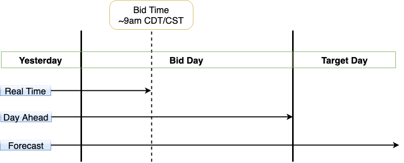

# DateOffsets

DateOffsets.jl provides types and functions to generate observation dates with specific properties.
These dates can be used to construct the inputs and outputs of models using [Features.jl](https://gitlab.invenia.ca/invenia/Features.jl).

Users should be aware of the data that EIS is expected to have access to at bid time in Production as this will inform which `DateOffset`s to use.
There are 3 components to understanding how to use DateOffsets.jl:
1. How to define your targets using [Horizons](@ref horizons).
2. How to decide the required [DateOffsets](@ref date-offsets) based on the data availability.
3. How to construct [observation intervals](@ref observation-intervals) from the offsets.

For a definition of the terms used in this package, see the [glossary](#glossary) below.

## [Why Date Offsets?](@id why-date-offsets)

Time-series forecasting using grid data comes with a number of challenges:
1. Data for particular grids and sources are made available at different times.
2. Data that is available is typically lagged by some amount of time.
3. Grids operate in various timezones and DST transitions change the number of hours in a day.
4. We do not have an [accurate release history](https://gitlab.invenia.ca/invenia/brainstorming-bonanza/-/issues/117) of the data published by the grids.

The first two points in particular are relevant to the [bid process timeline](https://gitlab.invenia.ca/invenia/wiki/blob/master/eis/intro-to-eis.md#bid-process-timeline-and-data-availability) when [EIS](https://gitlab.invenia.ca/invenia/eis) runs in production.
The diagram below illustrates the latest availability of three different kinds of feeds at bid time.

Trying to manually generate observations for each target in a model would require users to write code that addresses each of the edge cases above.
This alone would be an overly difficult task in itself, but as our use-cases continue to arise, the code would likely grow in complexity and become evermore difficult to maintain and overly brittle with time.
This approach is not only impractical from an engineering perspective, it also increases the risk of generating incomplete or incorrect data which jeopardizes the model training.

A more robust approach, that recognises the complexities of time-series data mentioned above and scales with our needs, is therefore more desirable.
This highlights the most important aspect of using DateOffsets.jl: **knowing the data that EIS is expected to have access to at bid time and which observations you need to use as a result**.

## Glossary

There are many terms used in relation to fetching data from the database, some of which can be erroneously used interchangeably.
For that reason, we define below the terms used throughout DateOffsets.jl to avoid any confusion:

**Horizon**: A type that is used, in conjunction with the `sim_now`, to define the targets for a forecaster, which are calculated by calling [`DateOffsets.targets`](@ref).

**Bid Time**: This is the time at which [EIS dailybid](https://gitlab.invenia.ca/invenia/wiki/blob/master/production/bid-process.md) commences for a given market, defined by `ElectricityMarkets.ops_start`.
For a backrun, or just forecasting, it represents the "simulated" bid time for the task.
There is only one "bid time" for a given day of bidding, hence, in higher level code, it may also be referred to as the "global" `sim_now`.

**Sim Now**: For a given `BidTime` this represents the "local" `sim_now` for the corresponding training days.
There are typically many training `sim_now`s for a given day of bidding.

**Target**: An interval in time, usually in the future, for which we want to predict some quantity of interest.
The most common target is an `HourEnding` interval -- for when we want to predict delta LMPs -- although we sometimes use `DayEnding` intervals when we predict something _once_ for the target day, e.g. cliquing the nodes in [`NodeSelection`](https://invenia.pages.invenia.ca/NodeSelection.jl/).

**Observation**: An interval in time, usually in the past, that is associated with a target and used as input to a forecaster either for training or predicting for that target.

**Origin**: An interval in time, usually the `sim_now` or target, that is used as a starting point from which observations are derived.
The `OffsetOrigins` container stores these values, which serves as the input to [`DateOffset`](@ref)s

**Offset**: A step in time, taken relative to an origin, that is used to construct an observation for some target.

**Validity**: A term used in [S3DB](https://invenia.pages.invenia.ca/S3DB.jl/api/api.html#S3DB.Query-Tuple{}) and [DataFeeds](https://gitlab.invenia.ca/invenia/Datafeeds/Retrievers/-/blob/2a19a8dbb7c33659b47ab79429f3cae08c464676/docs/nodal_availability.md#table-columns) to refer to the interval of time for which a data entry in the database is "valid".
The entry that overlaps with the desired observation interval is the one that is fetched from the database.
For instance, LMP data resolved at 5-minute intervals will have disjoint validity intervals spanning 5 minutes, but their hourly aggregate will have a validity of 1 hour spanning the same length of time.

**Release Date**: The time at which a piece of data is available to be fetched from the database.
As we don't have [accurate release date](https://gitlab.invenia.ca/invenia/brainstorming-bonanza/-/issues/117) information, we often [cheat](https://gitlab.invenia.ca/invenia/wiki/-/tree/master/research#what-is-meant-by-cheating-in-backruns) when fetching data from the database, a practice which can sometimes lead to [Data Leakage](https://en.wikipedia.org/wiki/Leakage_(machine_learning)).
